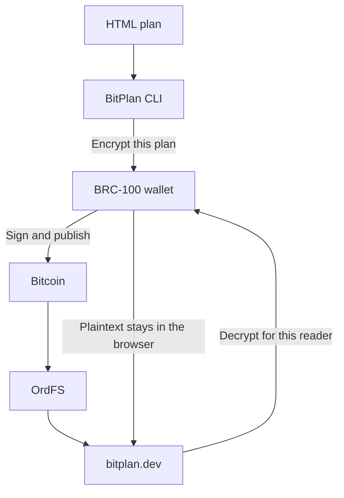
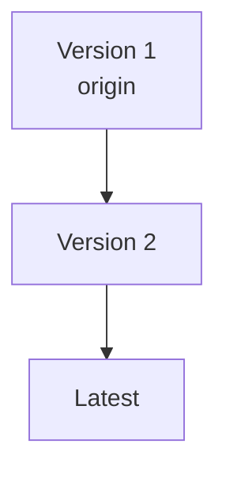
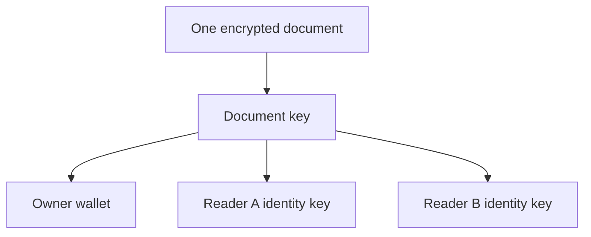

# BitPlan

Publish private, versioned HTML plans on Bitcoin.

[Open BitPlan](https://bitplan.dev) · [Read the docs](https://bitplan.dev/docs) · [Install the CLI](https://www.npmjs.com/package/bitplan)

BitPlan turns a self-contained HTML file into an encrypted 1Sat Ordinal. Your
BRC-100 wallet handles encryption, signing, payment, and decryption. Each new
version moves the same satoshi forward, giving the plan one permanent origin.

## Quick start

```sh
npx bitplan auth
npx bitplan upload ./plan.html
```

The command prints a private BitPlan link. Open it in a browser, connect the
authorized wallet, and read the plan.

```sh
npx bitplan list
npx bitplan fetch <origin>
npx bitplan version
```

## How it works



The CLI validates the HTML, then your wallet encrypts and publishes it. BitPlan
loads the encrypted document through OrdFS and asks your wallet to decrypt it.

Versions keep the same origin:



## Share a plan

Add one or more BRC-100 identity keys when publishing:

```sh
npx bitplan upload ./plan.html \
  --share-with <identity-key>
```

The document is encrypted once. Its document key is wrapped separately for
the owner and each invited reader.



## Documentation

- [How BitPlan works](https://bitplan.dev/docs/how-it-works)
- [CLI setup](https://bitplan.dev/docs/cli-setup)
- [Agents and wallets](https://bitplan.dev/docs/agents)
- [CLI commands](https://bitplan.dev/docs/commands)
- [Encrypted envelope](https://bitplan.dev/docs/envelope)

## Repository

| Path | Contents |
| --- | --- |
| [`apps/web`](apps/web) | Next.js website, plan viewer, docs, and sponsorships |
| [`packages/cli`](packages/cli) | Published `bitplan` command-line package |

```sh
bun install --frozen-lockfile
bun run lint
bun run typecheck
bun test
bun run build
```

Compatibility tests open CLI-produced envelopes with the website
implementation. Wallet and network boundaries use mocks, so the automated
suite never publishes a transaction.

Contributions are welcome. Start with [CONTRIBUTING.md](CONTRIBUTING.md).

## License

[MIT](LICENSE) · Third-party notices are listed in
[THIRD_PARTY_NOTICES.md](THIRD_PARTY_NOTICES.md).
